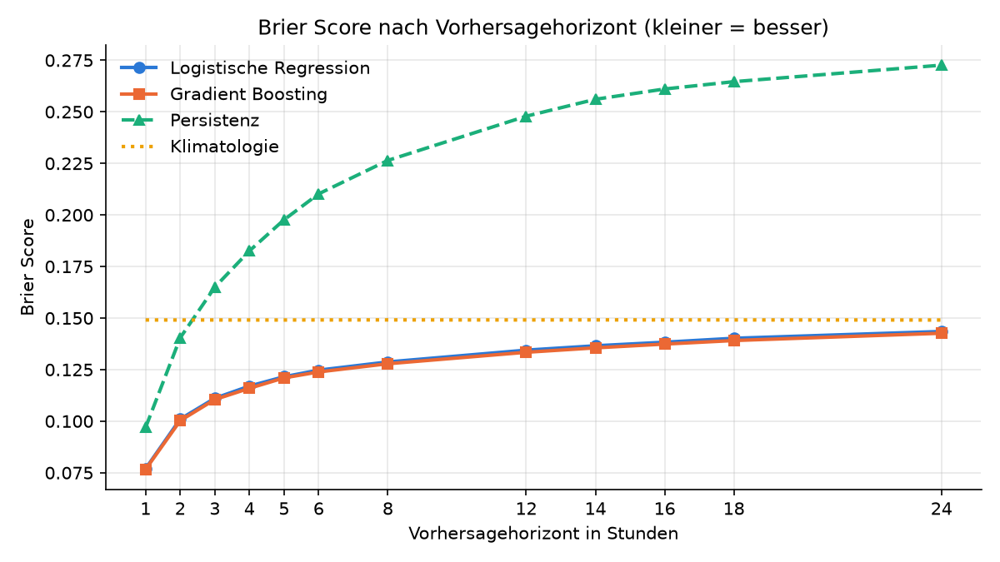
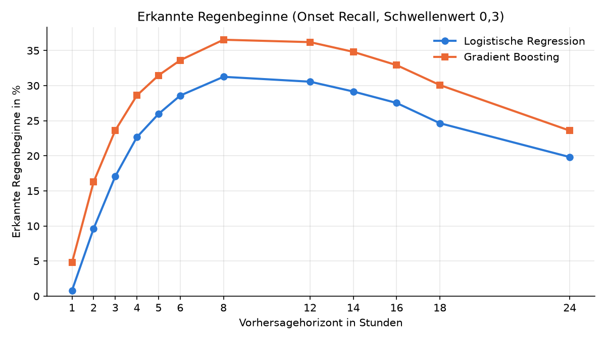

# Regenvorhersage mit DWD-Wetterdaten

## Forschungsfrage

Ab welchem Vorhersagehorizont ist ein einfaches Machine-Learning-Modell bei der Vorhersage von Regen besser als die simple Regel "das Wetter bleibt, wie es gerade ist" (Persistenz), und wie schneidet es im Vergleich zu einem komplexeren, nichtlinearen Modell (Gradient Boosting) ab?

Das Wetter ist ein chaotisches System, und die Frage, inwieweit ein so simples Modell wie die logistische Regression Regen vorhersagen kann, hat mich zu diesem Projekt gebracht. Außerdem bietet es eine gute Möglichkeit, meine ersten Erkenntnisse in Machine Learning anzuwenden und den Umgang mit GitHub zu lernen.

## Daten

- Quelle: Deutscher Wetterdienst (DWD), Open Data, stündliche Stationsdaten
- Station: Angermünde (Stations-ID 164)
- Zeitraum: 2000 bis 2025
- Messgrößen: Temperatur, Luftfeuchte, Taupunkt, Luftdruck, Wind, Bewölkung, Niederschlag

## Vorgehen

1. **Datenaufbereitung:** DWD-Dateien laden, zusammenführen, fehlende Werte (-999) entfernen
2. **Features:** z. B. Taupunktdifferenz, Druckänderung über 3 Stunden, Bewölkung, Jahreszeit
3. **Modelle:** Logistische Regression und Gradient Boosting, die vorhersagen, ob es in 1 bis 24 Stunden regnet
4. **Zeitliche Aufteilung:** Training bis 2020, Test ab 2021 (kein zufälliges Mischen, damit das Modell nicht in die Zukunft schaut)
5. **Vergleich:** Persistenz und Klimatologie auf exakt denselben Teststunden

## Ergebnisse

### Logistische Regression vs. Baselines

| Horizont | F1 Logit  | F1 Persistenz | Brier Logit  | Brier Persistenz  | Brier Klimatologie |
|---|---|---|---|---|---|
| 1 h      |   0.74    |     0.74      |    0.077     |      0.097        |       0.149        |
| 3 h      |   0.57    |     0.56      |    0.111     |      0.165        |       0.149        |
| 6 h      |   0.49    |     0.44      |    0.125     |      0.210        |       0.149        |
| 12 h     |   0.42    |     0.34      |    0.134     |      0.248        |       0.149        |
| 24 h     |   0.32    |     0.27      |    0.143     |      0.273        |       0.149        |

**Interpretation:**
Die Ergebnisse zeigen, dass mein Modell gemessen am F1-Score bei einer und drei Stunden noch keinen großen Unterschied zur Persistenz zeigt. Erst ab ca. sechs Stunden hat das Modell in Bezug auf Precision und Recall einen leichten Vorteil. Der Brier Score hingegen zeigt, dass die Wahrscheinlichkeiten des Modells schon ab einer Stunde besser sind als die der Persistenz und auch besser als der Durchschnitt (Klimatologie). Gegenüber der Persistenz baut sich dieser Vorteil bei größeren Horizonten noch weiter aus. Gegenüber der Klimatologie wird er dagegen immer kleiner und ist bei 24 Stunden nur noch knapp vorhanden.

### Gradient Boosting vs. Baselines

| Horizont | F1 Grad   | F1 Persistenz | Brier Grad   | Brier Persistenz  | Brier Klimatologie |
|---|---|---|---|---|---|
| 1 h      |   0.74    |     0.74      |    0.077     |      0.097        |       0.149        |
| 3 h      |   0.57    |     0.56      |    0.110     |      0.165        |       0.149        |
| 6 h      |   0.50    |     0.44      |    0.124     |      0.210        |       0.149        |
| 12 h     |   0.43    |     0.34      |    0.133     |      0.248        |       0.149        |
| 24 h     |   0.34    |     0.27      |    0.143     |      0.273        |       0.149        |

**Interpretation:**
Das Gradient-Boosting-Modell zeigt gegenüber den Baselines ein sehr ähnliches Verhalten wie die logistische Regression. Im Vergleich mit den Baselines gibt es also zunächst keinen zusätzlichen Vorteil.

### Logistische Regression vs. Gradient Boosting

| Horizont | F1 Grad   | F1 Logit | Brier Grad | Brier Logit | Onset Recall Grad | Onset Recall Logit | ROC-AUC Grad | ROC-AUC Logit |
|---|---|---|---|---|---|---|---|---|
| 1 h      |   0.74    |   0.74   |   0.077    |    0.077    |       0.05        |       0.01         |     0.92     |     0.91      |
| 3 h      |   0.57    |   0.57   |   0.110    |    0.111    |       0.24        |       0.17         |     0.85     |     0.84      |
| 6 h      |   0.50    |   0.49   |   0.124    |    0.125    |       0.34        |       0.29         |     0.80     |     0.79      |
| 12 h     |   0.43    |   0.42   |   0.133    |    0.134    |       0.36        |       0.31         |     0.75     |     0.74      |
| 24 h     |   0.34    |   0.32   |   0.143    |    0.143    |       0.24        |       0.20         |     0.69     |     0.69      |

**Interpretation:**
Die beiden Modelle sind in den ausgewählten Vergleichswerten ziemlich ähnlich. Das Gradient-Boosting-Modell scheint überall minimal besser oder gleich gut zu sein, allerdings müsste die Signifikanz dieses Unterschieds noch getestet werden. Der einzige interessante Unterschied zeigt sich beim Onset Recall, der den Anteil der erkannten Regenbeginne angibt: Hier hat das Gradient-Boosting-Modell 4 bis 7 Prozentpunkte mehr Regenbeginne vorhergesagt als das lineare Modell. Ein Grund dafür könnten nichtlineare Effekte sein, die das Boosting-Modell besser erfassen kann. Wie gut ein Modell Regen von Nicht-Regen unterscheiden kann, zeigt der ROC-AUC-Score. Er ist bei beiden Modellen nahezu identisch.

### Beantwortung der Forschungsfrage




Wie die Vergleichswerte und auch die Plots zeigen, ist das lineare Modell in einigen Aspekten besser als die Baselines. Der F1-Score zeigt, dass das Modell gemessen an Precision und Recall erst ab ca. 6 Stunden einen Vorteil gegenüber der Persistenz hat. Im Brier Score ist es schon ab der ersten Stunde besser. Das liegt aber auch daran, dass die Persistenz nur Wahrscheinlichkeiten von genau 0 oder 1 ausgibt, was beim Brier Score bei jedem Fehler hart bestraft wird. Das Modell hält sogar in vielen Kennwerten mit dem Gradient-Boosting-Modell mit und ist lediglich schlechter darin, Regenbeginne zu erkennen. Insgesamt ist also ein Mehrwert des linearen Modells zu erkennen, der durch weitere Anpassungen und Features noch ausgebaut werden könnte.

## Grenzen

- Nur eine einzelne Station, keine Informationen über das Wetter in der Umgebung
- Nur einfache Modelle mit wenigen Features
- Der Schwellenwert von 0,3 (ab welcher Wahrscheinlichkeit "Regen" gesagt wird) ist für alle Horizonte gleich und wurde nicht auf einem separaten Validierungszeitraum bestimmt
- Die kleinen Unterschiede zwischen den beiden Modellen wurden nicht auf Signifikanz getestet

## Ausblick

- Messwerte von Nachbarstationen als zusätzliche Features, kombinierbar mit der Windrichtung, um die Regenwahrscheinlichkeiten der Stationen zu gewichten
- Projekt mit eigenen Sensoren, die Features wie Luftdruck und Temperatur liefern, um die Frage zu beantworten, ob und wie solche Messungen zusammen mit den Vorhersagen echter Wetteranbieter in der Umgebung die Vorhersagen verbessern

## Projekt starten

```bash
pip install -r requirements.txt
python -m src.main
```

Die DWD-Rohdaten liegen bereits im Ordner `data/raw/`.

## Projektstruktur

```
src/
├── config.py             Einstellungen (Zeiträume, Vorhersage-Stunden, Schwellenwert)
├── data_loader.py        DWD-Dateien laden
├── preprocessing.py      Daten bereinigen und zusammenführen
├── features.py           Features berechnen
├── logistic_model.py     Logistische Regression
├── gradient_boosting.py  Gradient Boosting
├── baseline.py           Persistenz- und Klimatologie-Baseline
├── evaluation.py         Bewertung (F1, Accuracy, ROC-AUC, Brier Score, Onset Recall)
└── main.py               startet alles
```

## Hinweis zur Entwicklung

Bei der Strukturierung des Projekts und beim Verständnis einzelner Konzepte habe ich KI-Assistenz (Claude) genutzt. Dabei habe ich den Code selbst geschrieben und mir lediglich Tipps und Verbesserungsvorschläge geholt, sowie neue Sachen erklären lassen. Die Notebooks, in denen Anfangs experimentiert wurde, wurden für die Übersichtlichkeit gelöscht.
